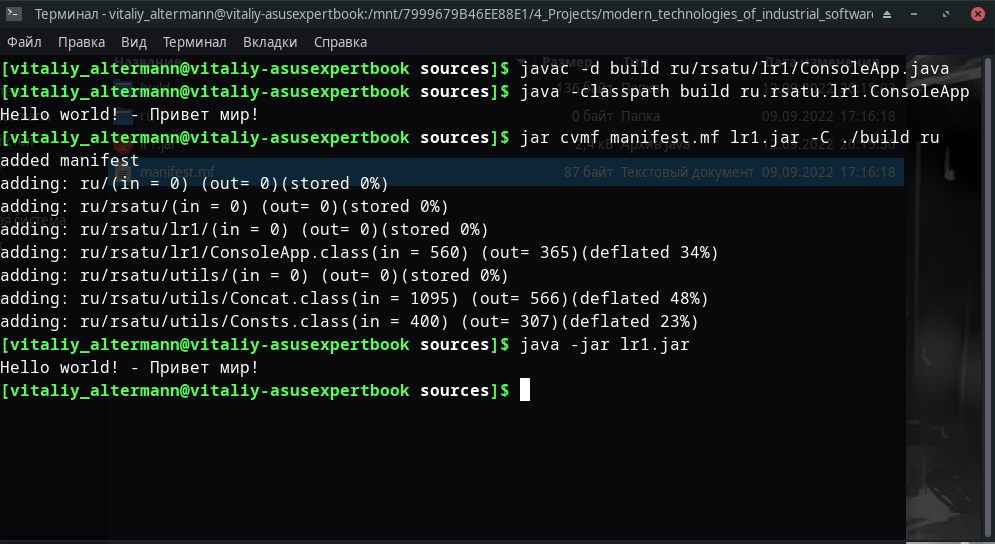

= Отчет по лабораторной работе No.1
:listing-caption: Листинг
:source-highlighter: coderay

Студент: Перхуров В.А.

Группа: ИВМ-22

== 1. Постановка задачи

В процессе выполнения лабораторной работы необходимо выполнить следующие задачи:

. Создать исполняемый java класс, который выводит текстовую строку на экран
. Разработать два класса. Первый класс вызывает 2 метода из второго класса (статический и не статический)
. Создать jar-файл, хранящий элементы из предыдущего задания

== 2. Разработка задачи

=== 2.1 Структура проекта

Проект разделен на следующие директории:

docs::
Данная документация

sources::
Содержит manifest.mf, сгенерированный jar-файл и две папки:

build:::
Сборочная директория, где хранятся собранные class-файлы.

ru/rsatu:::
Иерархия исходников, где хранятся main-класс и вспомогательные классы в виде java-файлов.

lr1::::
Содержит main-класс в файле ConsoleApp.java, из которого вызывается 1 статический метод и несколько обычных из созданного объекта класса Concat.java.

utils::::
Содержит 2 вспомогательных класса: Consts.java и Concat.java.
Класс Consts содержит константы, а класс Concat - методы конкатенации и вывода в консоль.

== 3. Информация о реализации

Сначала были созданы необходимые директории. Далее был создан исполняемый (ConsoleApp) и вспомогательные (Consts и Concat) классы. 

.Листинг класса ConsoleApp

[source,java]
----
package ru.rsatu.lr1;

import ru.rsatu.utils.Consts;
import ru.rsatu.utils.Concat;

public class ConsoleApp {
   public static void main(String[] args)
   {
      Concat concat = new Concat();
      concat.Add(Consts.EN_HELLO_WORLD);
      concat.Add(" - ");
      concat.Add(Consts.RU_HELLO_WORLD);
      Concat.Print( concat );
   }
}
----

.Листинг класса Consts

[source,java]
----
package ru.rsatu.utils;

public class Consts {
   public static String EN_HELLO_WORLD = "Hello world!";
   public static String RU_HELLO_WORLD = "Привет мир!";
}
----

.Листинг класса Concat

[source,java]
----
package ru.rsatu.utils;

public class Concat {
   public static void Print(Concat cnct)
   {
      System.out.println(cnct.Get());
   }

   public void Add(String str)
   {
      mTxt += str;
   }
   
   public String Get()
   {
      return mTxt;
   }

   private String mTxt = "";
}
----

Для компиляции файла через терминал использовалась команда "javac". Для компиляции результирующих фалов *.class использовал ключ "-d" с указанием сборочной директории build.

.Команда javac
----
javac -d build ru/rsatu/lr1/ConsoleApp.java
----

Для запуска файла из терминала использовалась команда "java", но т.к. объектные файлы были сгенерированы в отдельной сборочной директории для запуска был использован ключ "-classpath"  с указанием сборочной директории build.

.Команда java
----
java -classpath build ru.rsatu.lr1.ConsoleApp
----

Результат работы скомпилированного файла

.Результат работы
----
Hello world! - Привет мир!
----

Далее был создан jar-файл. Для его создания был создан файл manifest.mf, в котором указан главные исполняемый класс ConsoleApp

.Листинг manifest.mf
[source,java]
----
Manifest-Version: 1.0
Created-By: Vitaliy Perhurov
Main-Class: ru.rsatu.lr1.ConsoleApp
----

После этого была выполнена команда по сборке архива jar и запуск jar-файла

.Команда по сборке архива
----
jar cvmf manifest.mf lr1.jar -C ./build ru
----

.Запуск jar-файла
----
java -jar lr1.jar
----

В результате выполнения выводится следующее:

.Результат выполнения
----
Hello world! - Привет мир!
----

== 4. Результаты выполнения

В результате выполнения задания было выполнено:

* созданы классы ConsoleApp в директории ru/rsatu/lr1, Concat и Consts в директории ru/rsatu/utils;

* созданные классы были скомпилированы в папку build с помощью команды javac с ключом "-d";

* был запущен исполняемый класс через терминал с помощью команды java с ключом "-classpath";

* для последующего создания исполняемого jar-файлы был создан файл manifest.mf;

* с помощью команды jar был создан исполняемый jar-файл;

* был запущен jar-файл с помощью команды java с ключом "-jar".

Вся последовательность продемонстрирована на следующем скриншоте:

== 5. Вывод

В результате выполнения лабораторной работы получены навыки по компиляции классов, запуску проектов, созданию jar-файлов с помощью командной строки.