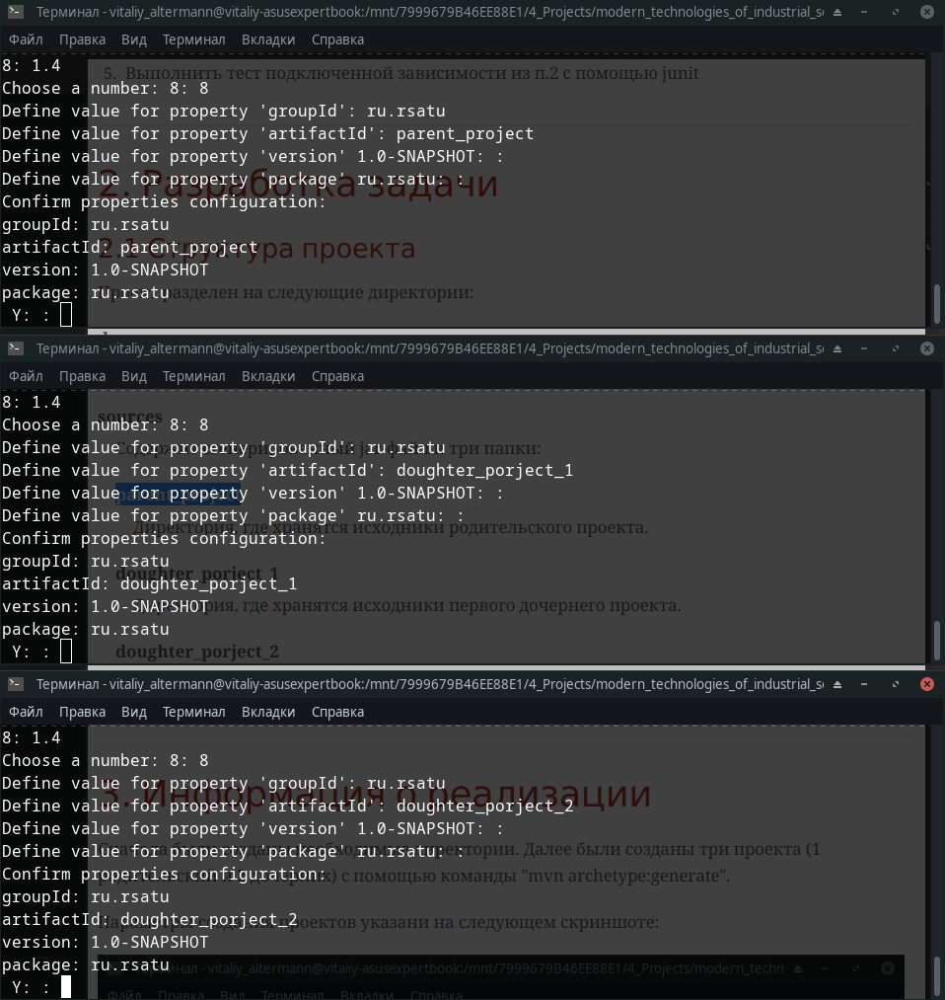
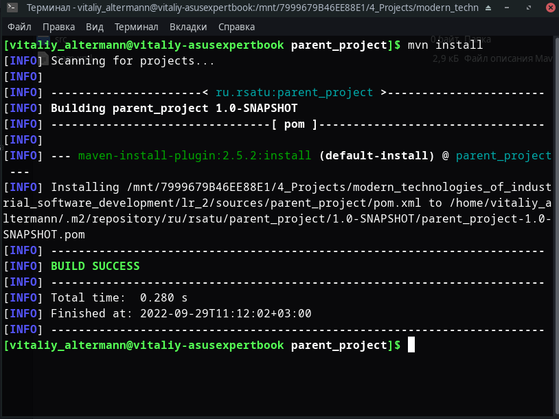
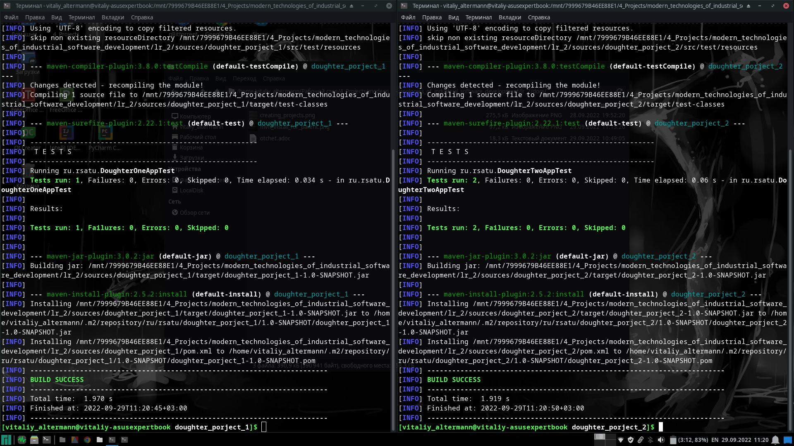
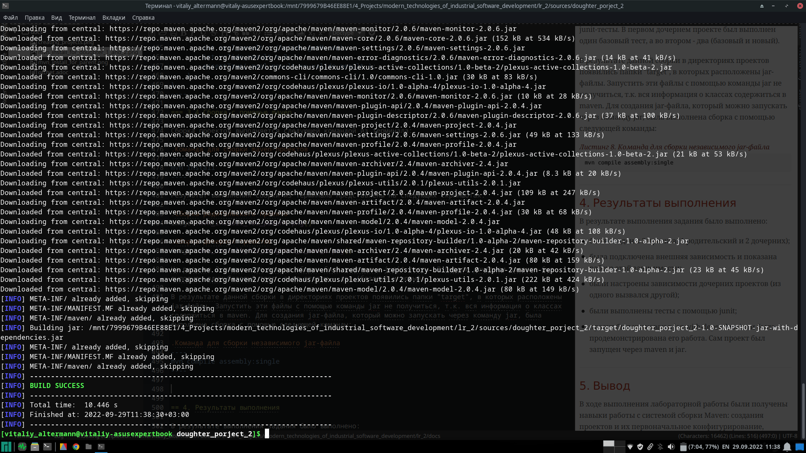
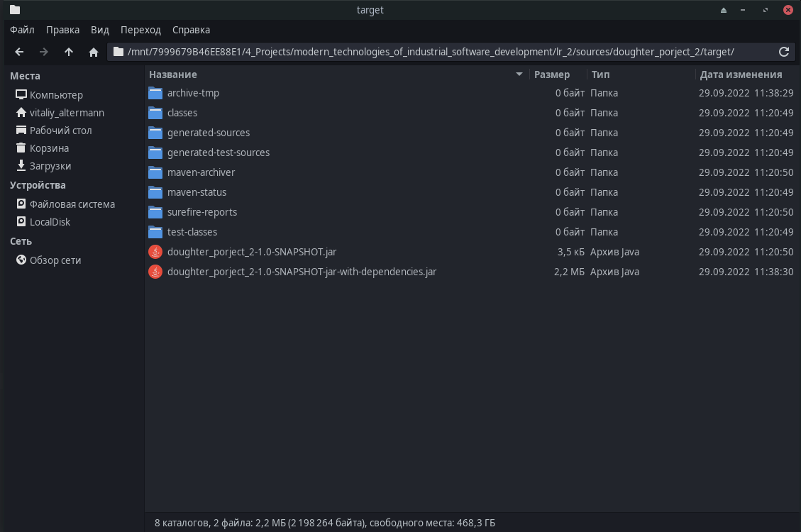
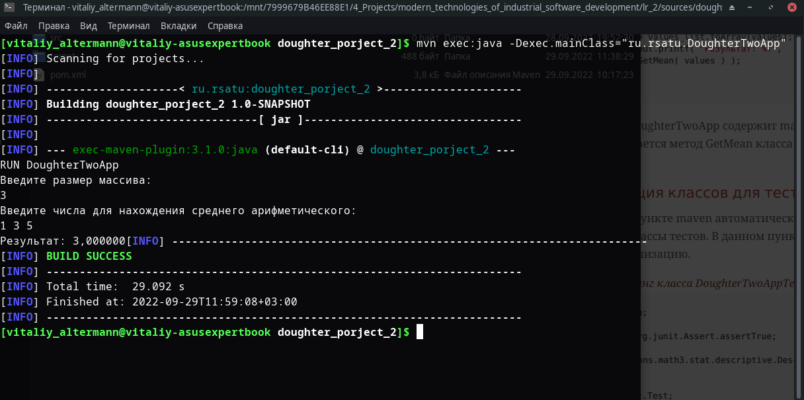
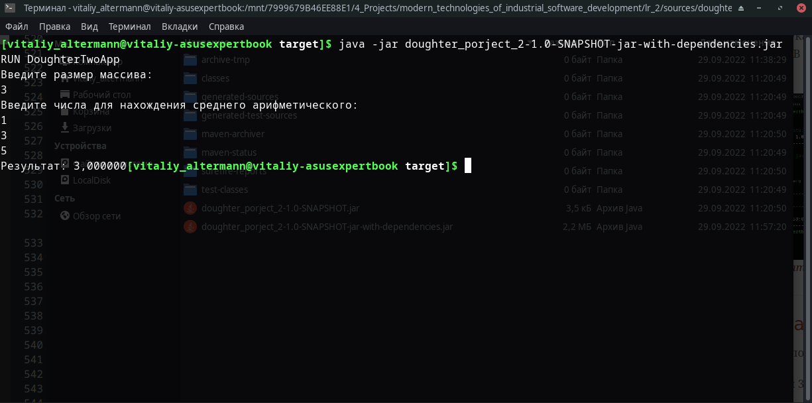

= Отчет по лабораторной работе No.2
:listing-caption: Листинг
:source-highlighter: coderay

Студент: Перхуров В.А.

Группа: ИВМ-22

== 1. Постановка задачи

В процессе выполнения лабораторной работы необходимо выполнить следующие задачи:

. Создать несколько maven-проектов:
    .. Родительский
    .. 2 Дочерних (1 дочерний проект зависит от второго)
. Подключить внешнюю зависимость (из глобального репозитория) в один из проектов и продемонстрировать работу этой зависимости.
. Создать maven-проект, который будет помещен в локальный репозиторий. Добавить этот проект как зависимость в проект из п.1
. Создать maven-проект, упаковать его в jar-with-dependencies, продемонстрировать работу jar. Запустить проект с помощью maven.
. Выполнить тест подключенной зависимости из п.2 с помощью junit

== 2. Разработка задачи

=== 2.1 Структура проекта

Проект разделен на следующие директории:

docs::
Данная документация

sources::
Содержит сгенерированный jar-файл и три папки:

parent_project:::
Директория, где хранятся исходники родительского проекта.

doughter_porject_1:::
Директория, где хранятся исходники первого дочернего проекта.

doughter_porject_2:::
Директория, где хранятся исходники второго дочернего проекта.

== 3. Информация о реализации

=== 3.1 Настройка проектов

Сначала были созданы необходимые директории. Далее были созданы три проекта (1 родительский и 2 дочерних) с помощью команды "mvn archetype:generate".

Параметры создания проектов указаны на следующем скриншоте:

Далее были настроены связи проектов путём изменения pom-файлов.

.Листинг pom-файла родительского проекта parent_project

[source,xml]
----
<?xml version="1.0" encoding="UTF-8"?>

<project xmlns="http://maven.apache.org/POM/4.0.0" xmlns:xsi="http://www.w3.org/2001/XMLSchema-instance"
  xsi:schemaLocation="http://maven.apache.org/POM/4.0.0 http://maven.apache.org/xsd/maven-4.0.0.xsd">
  <modelVersion>4.0.0</modelVersion>

  <groupId>ru.rsatu</groupId>
  <artifactId>parent_project</artifactId>
  <version>1.0-SNAPSHOT</version>
  <packaging>pom</packaging>

  <name>parent_project</name>
  <!-- FIXME change it to the project's website -->
  <url>http://www.example.com</url>

  <properties>
    <project.build.sourceEncoding>UTF-8</project.build.sourceEncoding>
    <maven.compiler.source>1.7</maven.compiler.source>
    <maven.compiler.target>1.7</maven.compiler.target>
  </properties>

  <dependencies>
    <!-- https://mvnrepository.com/artifact/org.apache.commons/commons-math3 -->
    <dependency>
       <groupId>org.apache.commons</groupId>
       <artifactId>commons-math3</artifactId>
       <version>3.6.1</version>
    </dependency>
    <dependency>
      <groupId>junit</groupId>
      <artifactId>junit</artifactId>
      <version>4.11</version>
      <scope>test</scope>
    </dependency>
  </dependencies>

  <build>
    <pluginManagement><!-- lock down plugins versions to avoid using Maven defaults (may be moved to parent pom) -->
      <plugins>
        <!-- clean lifecycle, see https://maven.apache.org/ref/current/maven-core/lifecycles.html#clean_Lifecycle -->
        <plugin>
          <artifactId>maven-clean-plugin</artifactId>
          <version>3.1.0</version>
        </plugin>
        <!-- default lifecycle, jar packaging: see https://maven.apache.org/ref/current/maven-core/default-bindings.html#Plugin_bindings_for_jar_packaging -->
        <plugin>
          <artifactId>maven-resources-plugin</artifactId>
          <version>3.0.2</version>
        </plugin>
        <plugin>
          <artifactId>maven-compiler-plugin</artifactId>
          <version>3.8.0</version>
        </plugin>
        <plugin>
          <artifactId>maven-surefire-plugin</artifactId>
          <version>2.22.1</version>
        </plugin>
        <plugin>
          <artifactId>maven-jar-plugin</artifactId>
          <version>3.0.2</version>
        </plugin>
        <plugin>
          <artifactId>maven-install-plugin</artifactId>
          <version>2.5.2</version>
        </plugin>
        <plugin>
          <artifactId>maven-deploy-plugin</artifactId>
          <version>2.8.2</version>
        </plugin>
        <!-- site lifecycle, see https://maven.apache.org/ref/current/maven-core/lifecycles.html#site_Lifecycle -->
        <plugin>
          <artifactId>maven-site-plugin</artifactId>
          <version>3.7.1</version>
        </plugin>
        <plugin>
          <artifactId>maven-project-info-reports-plugin</artifactId>
          <version>3.0.0</version>
        </plugin>
      </plugins>
    </pluginManagement>
  </build>
</project>
----

В этом файле были проведены следующие изменения:

. С помощью параметра "<packageing>...</packageing>" данный проект будет собран в "pom-проект".
. Была подключена математическая библиотека из внешнего репозитория "commons-math3".

.Листинг pom-файла первого дочернего проекта doughter_porject_1

[source,xml]
----
<?xml version="1.0" encoding="UTF-8"?>

<project xmlns="http://maven.apache.org/POM/4.0.0" xmlns:xsi="http://www.w3.org/2001/XMLSchema-instance"
  xsi:schemaLocation="http://maven.apache.org/POM/4.0.0 http://maven.apache.org/xsd/maven-4.0.0.xsd">
  <modelVersion>4.0.0</modelVersion>

  <parent>
    <groupId>ru.rsatu</groupId>
    <artifactId>parent_project</artifactId>
    <version>1.0-SNAPSHOT</version>
  </parent>

  <groupId>ru.rsatu</groupId>
  <artifactId>doughter_porject_1</artifactId>
  <version>1.0-SNAPSHOT</version>

  <name>doughter_porject_1</name>
  <!-- FIXME change it to the project's website -->
  <url>http://www.example.com</url>

  <properties>
    <project.build.sourceEncoding>UTF-8</project.build.sourceEncoding>
    <maven.compiler.source>1.7</maven.compiler.source>
    <maven.compiler.target>1.7</maven.compiler.target>
  </properties>

  <dependencies>
    <dependency>
      <groupId>junit</groupId>
      <artifactId>junit</artifactId>
      <version>4.11</version>
      <scope>test</scope>
    </dependency>
  </dependencies>

  <build>
    <pluginManagement><!-- lock down plugins versions to avoid using Maven defaults (may be moved to parent pom) -->
      <plugins>
        <!-- clean lifecycle, see https://maven.apache.org/ref/current/maven-core/lifecycles.html#clean_Lifecycle -->
        <plugin>
          <artifactId>maven-clean-plugin</artifactId>
          <version>3.1.0</version>
        </plugin>
        <!-- default lifecycle, jar packaging: see https://maven.apache.org/ref/current/maven-core/default-bindings.html#Plugin_bindings_for_jar_packaging -->
        <plugin>
          <artifactId>maven-resources-plugin</artifactId>
          <version>3.0.2</version>
        </plugin>
        <plugin>
          <artifactId>maven-compiler-plugin</artifactId>
          <version>3.8.0</version>
        </plugin>
        <plugin>
          <artifactId>maven-surefire-plugin</artifactId>
          <version>2.22.1</version>
        </plugin>
        <plugin>
          <artifactId>maven-jar-plugin</artifactId>
          <version>3.0.2</version>
        </plugin>
        <plugin>
          <artifactId>maven-install-plugin</artifactId>
          <version>2.5.2</version>
        </plugin>
        <plugin>
          <artifactId>maven-deploy-plugin</artifactId>
          <version>2.8.2</version>
        </plugin>
        <!-- site lifecycle, see https://maven.apache.org/ref/current/maven-core/lifecycles.html#site_Lifecycle -->
        <plugin>
          <artifactId>maven-site-plugin</artifactId>
          <version>3.7.1</version>
        </plugin>
        <plugin>
          <artifactId>maven-project-info-reports-plugin</artifactId>
          <version>3.0.0</version>
        </plugin>
      </plugins>
    </pluginManagement>
  </build>
</project>
----

В этом файле с помощью параметра "<parent>...</parent>" был указан родительский pom-проект.

.Листинг pom-файла второго дочернего проекта doughter_porject_2

[source,xml]
----
<?xml version="1.0" encoding="UTF-8"?>

<project xmlns="http://maven.apache.org/POM/4.0.0" xmlns:xsi="http://www.w3.org/2001/XMLSchema-instance"
  xsi:schemaLocation="http://maven.apache.org/POM/4.0.0 http://maven.apache.org/xsd/maven-4.0.0.xsd">
  <modelVersion>4.0.0</modelVersion>

  <parent>
    <groupId>ru.rsatu</groupId>
    <artifactId>parent_project</artifactId>
    <version>1.0-SNAPSHOT</version>
  </parent>

  <groupId>ru.rsatu</groupId>
  <artifactId>doughter_porject_2</artifactId>
  <version>1.0-SNAPSHOT</version>
  <packaging>jar</packaging>

  <name>doughter_porject_2</name>
  <!-- FIXME change it to the project's website -->
  <url>http://www.example.com</url>

  <properties>
    <project.build.sourceEncoding>UTF-8</project.build.sourceEncoding>
    <maven.compiler.source>1.7</maven.compiler.source>
    <maven.compiler.target>1.7</maven.compiler.target>
  </properties>

  <dependencies>
    <dependency>
      <groupId>ru.rsatu</groupId>
      <artifactId>doughter_porject_1</artifactId>
      <version>1.0-SNAPSHOT</version>
      <scope>compile</scope>
    </dependency>
    <dependency>
      <groupId>junit</groupId>
      <artifactId>junit</artifactId>
      <version>4.11</version>
      <scope>test</scope>
    </dependency>
  </dependencies>

  <build>
    <pluginManagement><!-- lock down plugins versions to avoid using Maven defaults (may be moved to parent pom) -->
      <plugins>
        <!-- clean lifecycle, see https://maven.apache.org/ref/current/maven-core/lifecycles.html#clean_Lifecycle -->
        <plugin>
          <artifactId>maven-clean-plugin</artifactId>
          <version>3.1.0</version>
        </plugin>
        <!-- default lifecycle, jar packaging: see https://maven.apache.org/ref/current/maven-core/default-bindings.html#Plugin_bindings_for_jar_packaging -->
        <plugin>
          <artifactId>maven-resources-plugin</artifactId>
          <version>3.0.2</version>
        </plugin>
        <plugin>
          <artifactId>maven-compiler-plugin</artifactId>
          <version>3.8.0</version>
        </plugin>
        <plugin>
          <artifactId>maven-surefire-plugin</artifactId>
          <version>2.22.1</version>
        </plugin>
        <plugin>
          <artifactId>maven-jar-plugin</artifactId>
          <version>3.0.2</version>
        </plugin>
        <plugin>
          <artifactId>maven-install-plugin</artifactId>
          <version>2.5.2</version>
        </plugin>
        <plugin>
          <artifactId>maven-deploy-plugin</artifactId>
          <version>2.8.2</version>
        </plugin>
        <!-- site lifecycle, see https://maven.apache.org/ref/current/maven-core/lifecycles.html#site_Lifecycle -->
        <plugin>
          <artifactId>maven-site-plugin</artifactId>
          <version>3.7.1</version>
        </plugin>
        <plugin>
          <artifactId>maven-project-info-reports-plugin</artifactId>
          <version>3.0.0</version>
        </plugin>
        <plugin>
          <artifactId>maven-assembly-plugin</artifactId>
          <configuration>
            <archive>
              <manifest>
                <mainClass>ru.rsatu.DoughterTwoApp</mainClass>
              </manifest>
            </archive>
            <descriptorRefs>
              <descriptorRef>jar-with-dependencies</descriptorRef>
            </descriptorRefs>
          </configuration>
          <executions>
            <execution>
              <id>make-assembly</id> <!-- this is used for inheritance merges -->
              <phase>package</phase> <!-- bind to the packaging phase -->
              <goals>
                <goal>single</goal>
              </goals>
            </execution>
          </executions>
        </plugin>
      </plugins>
    </pluginManagement>
  </build>
</project>
----

В этом файле были проведены следующие изменения:

. С помощью параметра "<packageing>...</packageing>" данный проект будет собран "jar-файл".
. Установлена зависимость от первого дочернего проекта "doughter_porject_1".
. Добавлен плагин для формирования jar-файла. Данный плагин сработает для цели "single".

=== 3.2 Реализация классов для запуска

В предыдущем пункте maven автоматически сгенерировал main-классы проектов. В данном пункте добавим в них реализацию.

.Листинг класса DoughterOneApp

[source,java]
----
package ru.rsatu;
import org.apache.commons.math3.stat.descriptive.DescriptiveStatistics;
import java.util.*;

public class DoughterOneApp 
{
    public static void main( String[] args )
    {
        System.out.println( "RUN DoughterOneApp" );
    }

    public static double GetMean( Integer[] values )
    {
        DescriptiveStatistics ds = new DescriptiveStatistics();
        for( int i=0; i < values.length; i++ )
        {
            ds.addValue( values[i] );
        }
        
        return ds.getMean();
    }
}
----

Класс ru.rsatu.DoughterOneApp содержит метод для нахождения среднего арифметического из введённого набора чисел.

.Листинг класса DoughterTwoApp

[source,java]
----
package ru.rsatu;
import ru.rsatu.DoughterOneApp;

import java.util.*;

public class DoughterTwoApp 
{
    public static void main( String[] args )
    {
        System.out.println( "RUN DoughterTwoApp" );
        
        System.out.println( "Введите размер массива: " );
        Scanner scan = new Scanner( System.in );
        int size = scan.nextInt();
        
        System.out.println( "Введите числа для нахождения среднего арифметического: " );
        ArrayList<Integer> values_list = new ArrayList<>();
        for( int i = 0; i < size; i++ )
        {
           values_list.add( scan.nextInt() );
        }
        
        Integer[] values = new Integer[values_list.size()];
        values = values_list.toArray(values);
        System.out.printf( "Результат: %f", DoughterOneApp.GetMean( values ) );
    }
}
----

Класс ru.rsatu.DoughterTwoApp содержит main-метод, из которого вызывается метод GetMean класса DoughterOneApp.

=== 3.3 Реализация классов для тестов

В предыдущем пункте maven автоматически сгенерировал классы тестов. В данном пункте добавим в один из них реализацию.

.Листинг класса DoughterTwoAppTest

[source,java]
----
package ru.rsatu;

import static org.junit.Assert.assertTrue;
import org.apache.commons.math3.stat.descriptive.DescriptiveStatistics;

import org.junit.Test;

/**
 * Unit test for simple DoughterTwoApp.
 */
public class DoughterTwoAppTest 
{
    /**
     * Rigorous Test :-)
     */
    @Test
    public void shouldAnswerWithTrue()
    {
        assertTrue( true );
    }

    @Test
    public void testAbs()
    {
        double[] values = new double[]{1,3,5};
        DescriptiveStatistics ds = new DescriptiveStatistics();
        for( int i = 0; i < 3; i++ )
        {
            ds.addValue(values[i]);
        }
        int real_result = (int)ds.getMean();
        int valide_result = 3;
        assertTrue( real_result == valide_result );
    }
}
----

=== 3.4 Сборка с помощью maven

Сборка проектов выполняется следующей командой из терминала:

.Команда для сборки maven-проектов
----
mvn install
----

Результат выполнения сборки из терминала представлены на следующих скриншотах:

.Сборка родительского проекта

.Сборка дочерних проектов

На рисунке 2 видно, что помимо сборки были выполнены junit-тесты. В первом дочернем проекте был выполнен один базовый тест, а во втором - два (базовый и новый). 

В результате данной сборки в директориях проектов появились папки "target", в которых расположены jar-файлы. Запустить эти файлы с помощью команды jar не получиться, т.к. вся информация о классах содержиться в maven. Для создания jar-файла, который можно запускать через команду jar, была выполнена сборка с помощью следующей команды:

.Команда для сборки независимого jar-файла
----
mvn compile assembly:single
----

.Сборка независимого jar-файла

В результате выполнения сборки независимого jar-файла были подтянуты все зависимости и загружены в один jar-файл (doughter_porject_2-1.0-SNAPSHOT-jar-with-dependencies.jar).

.Результат сборки независимого jar-файла

=== 3.5 Запуск итоговой программы с помощью maven

Запуск проета возможно произвести из maven, для этого необходимо выполнить команду:

.Команда для запуска программы через maven
----
mvn exec:java -Dexec.mainClass="ru.rsatu.DoughterTwoApp"
----

В этой команде явно указывается класс, который необходимо запустить. В результате работы программа вывела на экран строки:

.Результат работы программа, запущенной через maven

=== 3.6 Запуск итоговой программы с помощью java -jar

Запуск проета возможно произвести из java -jar, для этого необходимо выполнить команду:

.Команда для запуска программы через java -jar
----
java -jar java -jar lab2.3-1.0-SNAPSHOT-jar-with-dependencies.jar
----

В этой команде указывается jar-файл с вложенными зависимостями. В результате работы программа вывела на экран строки:

.Результат работы программа, запущенной через java -jar

== 4. Результаты выполнения

В результате выполнения задания было выполнено:

* были созданы 3 проекта (1 родительский и 2 дочерних);

* была подключена внешняя зависимость и показана работа этой зависимости;

* были настроены зависимости дочерних проектов (из одного вызвался другой);

* были выполнены тесты с помощью junit;

* проект был упакован в jar-with-dependencies и была продемонстрирована его работа. Сам проект был запущен через maven и jar.

== 5. Вывод

В ходе выполнения лабораторной работы были получены навыки работы с системой сборки Maven: создания проектов и их первоначальное конфигурирование, добавление как внешних, так и локальных зависимостей, создания и выполнения модульных тестов, сборки единого файла, содержащего все зависимости, а также запуска проектов.