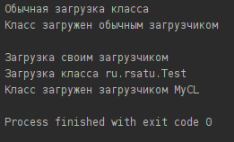
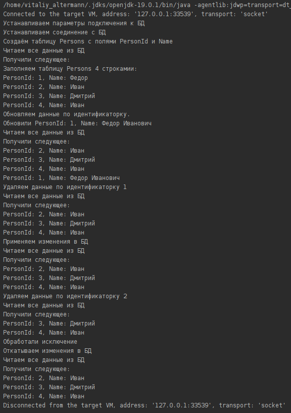

= Отчет по лабораторной работе No.4
:listing-caption: Листинг
:source-highlighter: coderay

Студенты: Перхуров В.А., Беляев А.Е.

Группа: ИВМ-22

== 1. Постановка задачи

В процессе выполнения лабораторной работы необходимо выполнить следующие задачи:

. ClassLoader
.. Ознакомится с руководством по загрузке классов и ClassLoader
.. Продемонстрировать работу своего загрузчика классов
.. Определить разницу между своей и стандартной реализацией
. JDBC
.. Установить соединение с БД с помощью JDBC драйвера
.. Создать таблицу БД с помощью JDBC
.. Реализовать CRUD-методы для одной таблицы
.. Реализовать несколько запросов в БД, которые должны выполняться в рамках одной транзакции
. Exception
.. Обернуть методы для работы с БД в try/catch с откатом транзакций и закрытием соединения
.. Продемонстрировать в программе откат транзакции

== 2. Разработка задачи

=== 2.1 Структура проекта

Проект разделен на следующие директории:

docs::
Данная документация

sources::
Содержит два подпроекта первый - задание реализации своего ClassLoader, второе - реализация работы с БД посредством JDBC:

part_1_classloader:::
Директория, где хранятся исходники реализации своего ClassLoader.

part_2_db:::
Директория, где хранятся исходники реализации работы с БД посредством JDBC.

== 3. Информация о реализации

=== 3.1 Реализация своего ClassLoader

Для выполнения задания по реализации своего загрузчика были созданы следующие классы:

Класс, который будет загружаться через стандартный и переопределённый загрузчики. Данный класс имеет одно публичное поле для вывода результаты работы в консоль и 2 приватных поля: массив строк, состоящий из 2 элементов и индекс. Далее с помощью своего загрузчика будет подменяться значение индекса. Его листинг представлен далее:

.Листинг класса Test
[source,java]
----
package ru.rsatu;

public class Test {
    // приватное поле, содержащее информацию каким загрузчиком был загружен данный класс
    private String[] mes={
        "Класс загружен обычным загрузчиком",
        "Класс загружен загрузчиком MyCL"
    };

    // приватное поле, указывающее на выводимое сообщение (индекс для mes)
    private static int i=0;
    
    public void Hello(){
        System.out.println(mes[i]);
    };
}
----

Свой класс-загрузчик. В данном классе происходит загрузка класса Test по его имени с подменой индекса. Его листинг представлен далее:

.Листинг класса-загрузчика MyCL
[source,java]
----
package ru.rsatu;
import java.lang.reflect.Field;

public class MyCL extends ClassLoader{
    public MyCL(ClassLoader s){
        super(s);
    }

    @Override
    public Class loadClass(String name) throws ClassNotFoundException {
        System.out.println("Загрузка класса "+ name);
        Class<?> a=super.loadClass(name);
        try {
            // получение доступа к приватному полю и его изменение
            Field i=a.getDeclaredField("i");
            i.setAccessible(true);
            i.set(a,1);
        } catch (NoSuchFieldException | IllegalAccessException e) {
            throw new RuntimeException(e);
        }
        return a;
    }
}
----

Главный класс. В данном классе выполняется загрузка класса Test двумя способами: стандартным загрузчиком и своим. Его листинг представлен далее:

.Листинг main-класса
[source,java]
----
package ru.rsatu;
import java.lang.reflect.InvocationTargetException;
import java.lang.reflect.Method;

public class Main {
    public static void main(String[] args) throws ClassNotFoundException,
                                                  InstantiationException,
                                                  NoSuchMethodException,
                                                  InvocationTargetException,
                                                  IllegalAccessException {
        //создание своего загрузчика
        MyCL mycl=new MyCL(Main.class.getClassLoader());

        //обычная загрузка класса
        System.out.println("Обычная загрузка класса");
        Test t1=new Test();
        t1.Hello();
        System.out.println();

        //загрузка своим загрузчиком
        System.out.println("Загрузка своим загрузчиком");
        //загрузка по имени с указанием своего загрузчика
        Class<?> test= Class.forName("ru.rsatu.Test",true,mycl);
        //создание объекта класса Test
        Object ob=test.getDeclaredConstructor().newInstance();
        Method a=ob.getClass().getMethod("Hello");
        //вызов метода
        a.invoke(ob);
    }
}
----

В ходе выполнения была произведена загрузка класса Test двумя способами: стандартным загрузчиком и своим. Результат выполнения представлен далее:

=== 3.2 Реализация работы с БД через JDBC

Для выполнения задания по реализации работы с БД посредством JDBC были созданы следующие классы:

Класс обёртка над БД, реализующий методы технологии CRUD (Создание, Чтение, Обновление и Удаление). Его листинг представлен далее:

.Листинг класса DbWrapper
[source,java]
----
package ru.rsatu.pojo;
import org.jetbrains.annotations.NotNull;
import java.sql.*;
import java.util.List;
import java.util.Map;

/**
 * Обёртка над стандратным интерфейсом работы с БД
 */
public class DbWrapper {

    /**
     * Метод чтения данных из БД
     * @param table_name имя таблицы
     * @param filter условие фильтрации
     * @return результат выполнения sql-запроса
     */
    public ResultSet Read(@NotNull String table_name, @NotNull String filter) throws SQLException {
        String query = "SELECT * FROM " + table_name;
        if (!filter.isEmpty())
            query += " WHERE " + filter;
        return this.statement.executeQuery(query);
    }

    /**
     * Метод добавления данных в БД
     * @param table_name имя таблицы
     * @param data_to_insert данные для создания
     */
    public void Create(@NotNull String table_name,
                       @NotNull List<Map<String,String>> data_to_insert) throws SQLException {
        // Формируем список Заполняемых полей
        String fields_str = "";
        for ( Map.Entry<String,String> field : data_to_insert.get(0).entrySet() ) {
            if(!fields_str.isEmpty())
                fields_str += ",";
            fields_str += field.getKey();
        }
        // Формируем список значений
        String values_str = "";
        for ( Map<String,String> values_map : data_to_insert ) {
            // Формируем один элемент данных для импорта
            String values_item_str = "";
            for ( Map.Entry<String,String> value : values_map.entrySet() ) {
                if (!values_item_str.isEmpty())
                    values_item_str += ",";
                values_item_str += value.getValue();
            }
            // Формируем итоговый набор данных для импорта
            if (!values_str.isEmpty())
                values_str += ",";
            values_str += "(" + values_item_str + ")";
        }
        String query = "INSERT INTO " + table_name + " (" + fields_str + ") VALUES " + values_str;
        this.statement.execute(query);
    }

    /**
     * Метод обновления данных в БД
     * @param table_name имя таблицы
     * @param data_to_update данные для обновления
     * @param filter фильтр для обновления
     */
    public void Update(@NotNull String table_name,
                       @NotNull Map<String,String> data_to_update,
                       @NotNull String filter) throws SQLException {
        String new_values_str = "";
        for ( Map.Entry<String,String> new_value : data_to_update.entrySet() ) {
            if (!new_values_str.isEmpty())
                new_values_str += ",";
            new_values_str += new_value.getKey() + " = " + new_value.getValue();
        }
        String query = "UPDATE " + table_name + " SET " + new_values_str;
        if (!filter.isEmpty())
            query += " WHERE " + filter;
        this.statement.execute(query);
    }

    /**
     * Метод удаления данных из БД
     * @param table_name имя таблицы
     * @param filter условие фильтрации
     */
    public void Delete(@NotNull String table_name, @NotNull String filter) throws SQLException {
        String query = "DELETE FROM " + table_name;
        if (!filter.isEmpty())
            query += " WHERE " + filter;
        this.statement.execute(query);
    }

    /**
     * Создать таблицу с указанием имени и полей
     * @param table_name имя таблицы
     * @param fields поля таблицы формата <имя> <---> <тип>
     * @throws SQLException
     */
    public void CreateTableIfNeed(@NotNull String table_name,
                                  @NotNull Map<String,String> fields) throws SQLException {
        String fields_str = "";
        for ( Map.Entry<String,String> pair : fields.entrySet() ) {
            if (!fields_str.isEmpty())
                fields_str += ", ";
            fields_str += pair.getKey() + " " + pair.getValue();
        }
        this.statement.execute("CREATE TABLE IF NOT EXISTS " + table_name + " (" + fields_str + ")");
    }

    /**
     * Применить изменения в БД
     * @throws SQLException
     */
    public void Commit() throws SQLException {
        System.out.println("Применяем изменения в БД");
        this.connection.commit();
    }

    /**
     * Откатить изменения в БД
     * @throws SQLException
     */
    public void RollbackChanges() throws SQLException {
        System.out.println("Откатываем изменения в БД");
        this.connection.rollback();
    }

    /**
     * Установить соединение с БД
     * @throws SQLException
     * @throws ClassNotFoundException
     */
    public void SetupConection() throws SQLException, ClassNotFoundException {
        System.out.println("Устанавливаем соединение с БД");
        String url = "jdbc:postgresql://localhost:5432/" + dbName;
        Class.forName("org.postgresql.Driver");
        this.connection = DriverManager.getConnection(url,userName,userPassword);
        this.connection.setAutoCommit(false);
        this.statement = this.connection.createStatement();
    }

    /**
     * Закрыть соединение с БД
     * @throws SQLException
     */
    public void CloseConection() throws SQLException {
        this.connection.close();
    }

    /**
     * Установить Имя БД
     * @param dbName имя БД
     */
    public void setDbName(String dbName) {
        this.dbName = dbName;
    }

    /**
     * Установить имя пользователя
     * @param userName имя пользователя
     */
    public void setUserName(String userName) {
        this.userName = userName;
    }

    /**
     * Установить пароль пользователя
     * @param userPassword пароль пользователя
     */
    public void setUserPassword(String userPassword) {
        this.userPassword = userPassword;
    }

    private String dbName;
    private String userName;
    private String userPassword;
    private Connection connection;
    private Statement statement;
}
----

Главный класс. В данном классе выполняются требуемые действия:

. Подключение к БД
. Создание табдицы
. Заполнение таблицы данными
. Обновление записей в таблицы
. Чтение данных из таблицы
. Обработка исключения (откат транзацкии)

Его листинг представлен далее:

.Листинг main-класса
[source,java]
----
package ru.rsatu;

import org.jetbrains.annotations.NotNull;
import ru.rsatu.pojo.DbWrapper;

import java.sql.*;
import java.util.ArrayList;
import java.util.HashMap;
import java.util.List;
import java.util.Map;

public class Main {
    public static void main(String[] args) throws ClassNotFoundException, SQLException {
        // Устанавливаем параметры подключения к БД
        System.out.println("Устанавливаем параметры подключения к БД");
        DbWrapper db = new DbWrapper();
        db.setDbName("hibernate");
        db.setUserName("hibernate");
        db.setUserPassword("hibernate");

        // Устанавливаем соединение с БД
        db.SetupConection();

        // Создаём таблицу
        CreateTable(db);

        // Вносим стартовые данные транзакцией
        ReadAllValues(db);
        InitTable(db);
        UpdateById(db, 1);
        ReadAllValues(db);
        DeleteById(db, 1);
        ReadAllValues(db);
        db.Commit();

        // Проверяем откат транзакции
        try {
            // Посмотрим что есть в базе на данный момент
            ReadAllValues(db);
            // Удалим одно поле
            DeleteById(db, 2);
            // Посмотрим что есть в базе на данный момент
            ReadAllValues(db);
            // Имитируем ошибку
            throw new SQLException();
        }
        catch (SQLException ex)
        {
            System.out.println("Обработали исключение");
            db.RollbackChanges();
        }
        // Посмотрим что есть в базе на данный момент
        ReadAllValues(db);

        // Закрываем соединение с БД
        db.CloseConection();
    }

    private static void CreateTable(@NotNull DbWrapper db) throws SQLException {
        System.out.println("Создаём таблицу Persons с полями PersonId и Name");
        String table_name = "Persons";
        Map<String,String> fields = new HashMap<>();
        fields.put("PersonId","int");
        fields.put("Name","varchar(255)");
        db.CreateTableIfNeed(table_name, fields);
    }

    private static void InitTable(@NotNull DbWrapper db) throws SQLException {
        System.out.println("Заполняем таблицу Persons 4 строкамии:");
        String table_name = "Persons";
        List<Map<String,String>> data_to_insert = new ArrayList<>();
        {
            System.out.println("PersonId: 1, Name: Федор");
            Map<String, String> first_values = new HashMap<>();
            first_values.put("PersonId", "1");
            first_values.put("Name", "'Федор'");
            data_to_insert.add(first_values);
        }
        {
            System.out.println("PersonId: 2, Name: Иван");
            Map<String, String> second_values = new HashMap<>();
            second_values.put("PersonId", "2");
            second_values.put("Name", "'Иван'");
            data_to_insert.add(second_values);
        }
        {
            System.out.println("PersonId: 3, Name: Дмитрий");
            Map<String, String> third_values = new HashMap<>();
            third_values.put("PersonId", "3");
            third_values.put("Name", "'Дмитрий'");
            data_to_insert.add(third_values);
        }
        {
            System.out.println("PersonId: 4, Name: Иван");
            Map<String, String> fourth_values = new HashMap<>();
            fourth_values.put("PersonId", "4");
            fourth_values.put("Name", "'Иван'");
            data_to_insert.add(fourth_values);
        }
        db.Create(table_name, data_to_insert);
    }

    private static void DeleteById(@NotNull DbWrapper db, @NotNull Integer id) throws SQLException {
        System.out.println("Удаляем данные по идентификаторку " + id.toString());
        String table_name = "Persons";
        String field_name = "PersonId";
        db.Delete(table_name, field_name + " = " + id.toString());
    }

    private static void UpdateById(@NotNull DbWrapper db, @NotNull Integer id) throws SQLException {
        System.out.println("Обновляем данные по идентификаторку.\n" +
                           "Обновили PersonId: " + id.toString() + ", Name: Федор Иванович");
        Map<String, String> new_values = new HashMap<>();
        new_values.put("PersonId", "1");
        new_values.put("Name", "'Федор Иванович'");
        String table_name = "Persons";
        db.Update(table_name, new_values, "PersonId = " + id.toString());
    }

    private static void ReadAllValues(@NotNull DbWrapper db) throws SQLException {
        System.out.println("Читаем все данные из БД");
        String table_name = "Persons";
        ResultSet rs = db.Read(table_name,"");
        System.out.println("Получили следующее:");
        while (rs.next()) {
            System.out.println("PersonId: " + rs.getString(1) + ", Name: " + rs.getString(2));
        };
    }
}
----

В ходе выполнения была создана таблица Persons с двумя полями PersonId и Name. Данная таблица была заполнена набором данных, которые в итоге были прочитаны, изменены и частично (по идентификатору) удалены. Результат выполнения представлен далее:

== 4. Вывод

В ходе выполнения лабораторной работы был написан свой ClassLoader и реализована работа с БД по схеме CRUD с обработкой исключений.