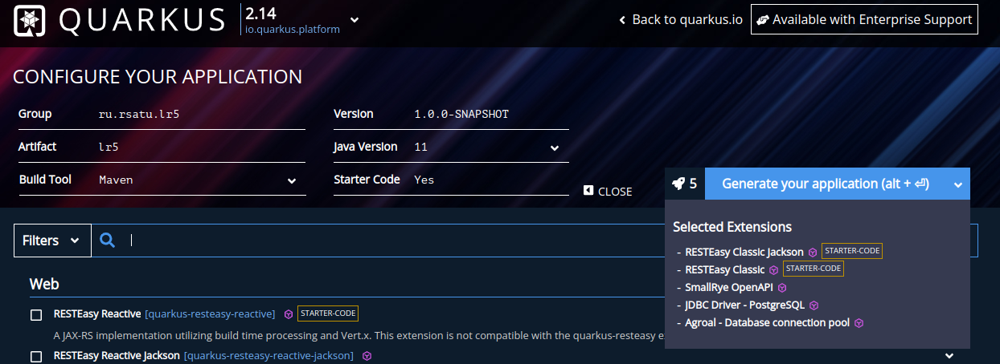
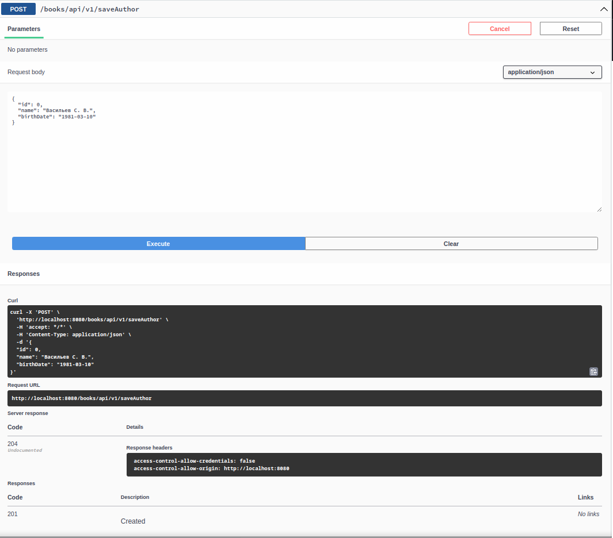
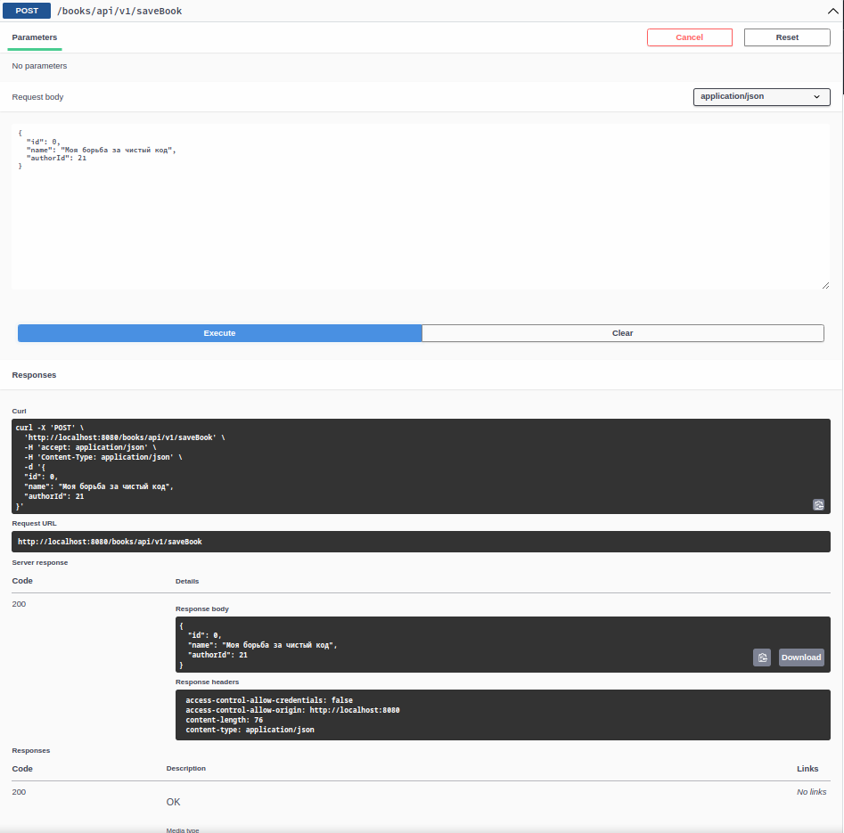
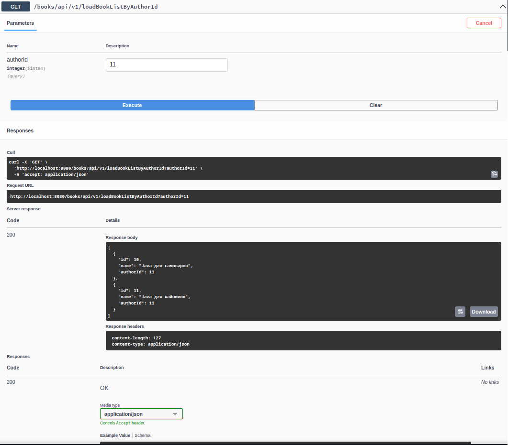
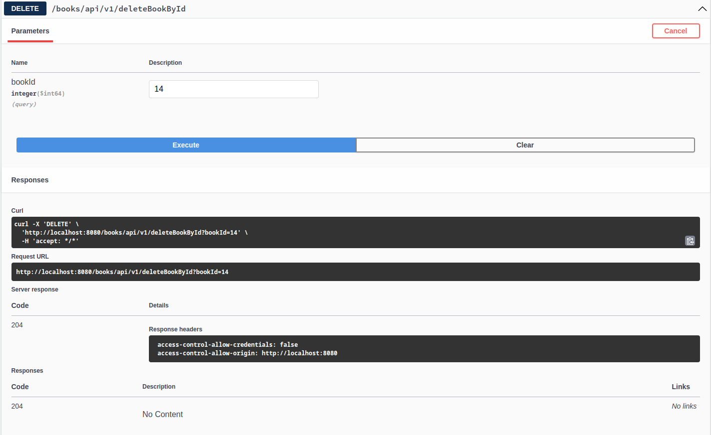
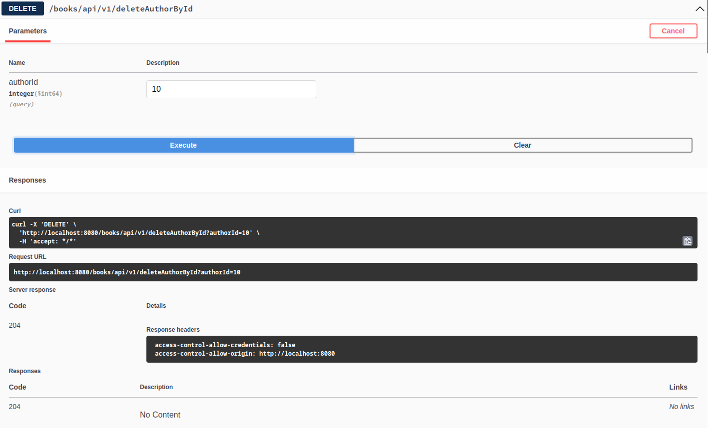

= Отчет по лабораторной работе No.5
:listing-caption: Листинг
:source-highlighter: coderay

Студенты: Перхуров В.А., Беляев А.Е.

Группа: ИВМ-22

== 1. Постановка задачи

В процессе выполнения лабораторной работы необходимо выполнить следующие задачи:

. С помощью Quarkus сформировать проект
. Подключить необходимые библиотеки и настроить работу с БД в файле application.properties
. Сформировать таблицы в БД
. Написать запросы для набора и изменений данных в БД:
.. Метод создания автора
.. Метод создания книги
.. Метод вывода всех книг с фильтром по ид автора
.. Метод удаления книги
.. Метод удаления автора

== 2. Разработка задачи

=== 2.1 Структура проекта

Проект разделен на следующие директории:

docs::
Данная документация

sources::
Содержит два подпроекта первый - серверна часть (backend), второй - веб интерфейс (frontend):

controller/src/main/java/ru/rsatu/lr5/:::
Директория, где хранятся исходники реализации серверна части

mapper::::
Директория с мапперами данных из модели БД в пользовательские модели

pojo/entity::::
Директория с описанием таблиц БД

pojo/dto::::
Директория с пользовательские моделями

repository::::
Директория с репозиториями для работы с БД (в ней описываются SQL-запросы)

service::::
Директория с сервисами для работы с готовыми моделями, полученными из БД

resource::::
Директория с классом, методы которого вызываются с веб-интерфейса

== 3. Информация о реализации

=== 3.1 Формирование проекта

Проект был сформирован с помощью сайта Quarkus как показано на следующем скриншоте:

.Формирование проекта на платформе Quarkus

После формирования проекта в него были подключены следующие дополнительные библиотеки:

. org.projectlombok

. org.mapstruct

. io.rest-assured

Кроме этого была проведена настройка файла application.properties. В нём были указаны тип используемой СУБД, адрес БД, имя и пароль от пользователя БД, а также поведение триггеров на создание, удаление и обновление таблиц при старте приложения. 

.Листинг настроечного файла application.properties
[source,xml]
----
# Datasource
quarkus.datasource.db-kind=postgresql
quarkus.datasource.jdbc.url=jdbc:postgresql://localhost:5432/postgres
quarkus.datasource.username=hibernate
quarkus.datasource.password=hibernate

#quarkus.hibernate-orm.database.generation=create
#quarkus.hibernate-orm.database.generation=drop-and-create
quarkus.hibernate-orm.database.generation=update
quarkus.hibernate-orm.log.sql=true

quarkus.swagger-ui.always-include=true

quarkus.http.cors=true
----

=== 3.2 Реализация entity-классов

В ходе реализации проекта были написаны 2 класса, реализующие 2 таблицы в БД:

Первый класс - Author. Он описывает поля таблицы authors.

.Листинг класса Author
[source,java]
----
package ru.rsatu.lr5.pojo.entity;

import lombok.Getter;
import lombok.Setter;

import javax.persistence.*;
import java.util.Date;

/**
 * Автор книги
 */
@Getter
@Setter
@Entity
@Table(name = "authors")
public class Author {
    @Id
    @GeneratedValue(strategy = GenerationType.SEQUENCE,
                    generator = "authors_id_gen")
    @SequenceGenerator(name = "authors_id_gen",
                       sequenceName = "authors_id_gen_seq",
                       initialValue = 10,
                       allocationSize = 10)
    private Long id;
    private String name;
    private Date birthDate;
    private String nickName;
}
----

Второй класс - Book. Он описывает поля таблицы books. В качестве связанной таблицы выступает таблица Author. Связь осуществляется по полям books.author_id и authors.id. 

.Листинг класса Book
[source,java]
----
package ru.rsatu.lr5.pojo.entity;

import lombok.Getter;
import lombok.Setter;

import javax.persistence.*;

/**
 * Книга
 */
@Getter
@Setter
@Entity
@Table(name = "books")
public class Book {
    @Id
    @GeneratedValue(strategy = GenerationType.SEQUENCE, 
                    generator = "books_id_gen")
    @SequenceGenerator(name = "books_id_gen",
                       sequenceName = "books_id_gen_seq",
                       initialValue = 10, 
                       allocationSize = 10)
    private Long id;
    private String name;
    @ManyToOne(cascade = CascadeType.ALL)
    @JoinColumn(name = "author_id")
    private Author author;
}
----

=== 3.3 Реализация dto-классов

Для этих таблиц были написаны 2 сокращённых (пользовательских) класса:

Первый класс - AuthorDto. Как видно на листинге ниже он отличается отсутствием поля nickName.

.Листинг класса AuthorDto
[source,java]
----
package ru.rsatu.lr5.pojo.dto;

import lombok.Getter;
import lombok.Setter;

import java.util.Date;

@Getter
@Setter
public class AuthorDto {
    private Long id;
    private String name;
    private Date birthDate;
}
----

Первый класс - BookDto.  Как видно на листинге ниже он отличается отсутствием поля author (объект), который заменён на поле authorId (идентификатор).

.Листинг класса BookDto
[source,java]
----
package ru.rsatu.lr5.pojo.dto;

import lombok.Getter;
import lombok.Setter;

@Getter
@Setter
public class BookDto {
    private Long id;
    private String name;
    private Long  как объекта;
}
----

=== 3.4 Реализация mapper-классов

Для удобного преобразования моделей были написаны 2 класса-маппера:

Первый класс - AuthorMapper. Он нужен для преобразования модели Author в AuthorDto и обратно. Данный маппер представлен на листинге ниже:

.Листинг класса AuthorMapper
[source,java]
----
package ru.rsatu.lr5.mapper;

import org.mapstruct.Mapper;
import org.mapstruct.Mapping;
import ru.rsatu.lr5.pojo.entity.Author;
import ru.rsatu.lr5.pojo.dto.AuthorDto;

import javax.inject.Inject;
import javax.persistence.EntityManager;

@Mapper(componentModel = "cdi")
public abstract class AuthorMapper {
    @Inject
    EntityManager entityManager;

    @Mapping(target = "id", source = "id")
    @Mapping(target = "name", source = "name")
    @Mapping(target = "birthDate", source = "birthDate")
    public abstract AuthorDto toAuthorDto(Author book);

    @Mapping(target = "id", source = "id")
    @Mapping(target = "name", source = "name")
    @Mapping(target = "nickName", source = "name")
    @Mapping(target = "birthDate", source = "birthDate")
    public abstract Author toAuthor(AuthorDto bookDto);
}
----

Второй класс - BookMapper. Он нужен для преобразования модели Book в BookDto и обратно. Данный маппер представлен на листинге ниже:

.Листинг класса BookMapper
[source,java]
----
package ru.rsatu.lr5.mapper;

import org.mapstruct.AfterMapping;
import org.mapstruct.Mapper;
import org.mapstruct.Mapping;
import org.mapstruct.MappingTarget;
import ru.rsatu.lr5.pojo.dto.BookDto;
import ru.rsatu.lr5.pojo.entity.Author;
import ru.rsatu.lr5.pojo.entity.Book;

import javax.inject.Inject;
import javax.persistence.EntityManager;

@Mapper(componentModel = "cdi")
public abstract class BookMapper {
    @Inject
    EntityManager entityManager;

    @Mapping(target = "id", source = "id")
    @Mapping(target = "name", source = "name")
    @Mapping(target = "authorId", source = "author.id")
    public abstract BookDto toBookDto(Book book);

    @Mapping(target = "id", source = "id")
    @Mapping(target = "name", source = "name")
    public abstract Book toBook(BookDto bookDto);

    @AfterMapping
    public void afterBookMapping(@MappingTarget Book result, BookDto bookDto) {
        Author author = entityManager.getReference(
            Author.class,
            bookDto.getAuthorId());
        result.setAuthor(author);
    }
}
----

=== 3.5 Реализация repository-классов

Для непосредственной работы с базой (выполнения sql-запросов) были написаны специальные классы.

Первый класс - AuthorRepository. Он предоставляет методы для набора, создания и изменения авторов в БД по переданным параметрам. Его листинг представлен ниже.

.Листинг класса AuthorRepository
[source,java]
----
package ru.rsatu.lr5.repository;

import ru.rsatu.lr5.mapper.AuthorMapper;
import ru.rsatu.lr5.pojo.dto.AuthorDto;
import ru.rsatu.lr5.pojo.entity.Author;

import javax.enterprise.context.ApplicationScoped;
import javax.inject.Inject;
import javax.persistence.EntityManager;
import javax.transaction.Transactional;
import java.util.List;

/**
 * Репозиторий для работы с авторами
 */
@ApplicationScoped
public class AuthorRepository {

    @Inject
    EntityManager entityManager;

    @Inject
    AuthorMapper authorMapper;

    public List<Author> loadAuthors() {
        return entityManager.createQuery("select a from Author a", Author.class)
                .getResultList();
    }

    /**
     * Сохранение автора
     */
    @Transactional
    public Author saveAuthor(AuthorDto authorDto) {
        Author author = authorMapper.toAuthor(authorDto);
        if (author.getId() != null) {
            entityManager.merge(author);
        } else {
            entityManager.persist(author);
        }
        entityManager.flush();
        return author;
    }

    /**
     * Удаление автора
     */
    @Transactional
    public void deleteAuthorById(Long author_id) {
        entityManager.createQuery("delete from Book where author_id=:id")
                .setParameter("id", author_id)
                .executeUpdate();
        entityManager.createQuery("delete from Author where id=:id")
                .setParameter("id", author_id)
                .executeUpdate();
    }
}
----

Второй класс - BooksRepository. Он предоставляет методы для набора, создания и изменения книг в БД по переданным параметрам. Его листинг представлен ниже.

.Листинг класса BooksRepository
[source,java]
----
package ru.rsatu.lr5.repository;

import ru.rsatu.lr5.mapper.BookMapper;
import ru.rsatu.lr5.pojo.dto.BookDto;
import ru.rsatu.lr5.pojo.entity.Book;

import javax.enterprise.context.ApplicationScoped;
import javax.inject.Inject;
import javax.persistence.EntityManager;
import javax.transaction.Transactional;
import java.util.List;

/**
 * Репозиторий для работы с книгами
 */
@ApplicationScoped
public class BooksRepository {

    @Inject
    EntityManager entityManager;

    @Inject
    BookMapper bookMapper;

    /**
     * Загрузить все книги
     */
    public List<Book> loadBooks() {
        return entityManager.createQuery("select b from Book b", Book.class)
            .getResultList();
    }

    /**
     * Загрузить книги конкретного автора
     */
    public List<Book> loadBooksByAuthorId(Long author_id) {
        return entityManager.createQuery(
            "select b from Book b where author_id = :author_id", Book.class)
            .setParameter("author_id", author_id)
            .getResultList();
    }

    /**
     * Сохранение книги
     */
    @Transactional
    public Book saveBook(BookDto bookDto) {
        Book book = bookMapper.toBook(bookDto);
        if (book.getId() != null) {
            entityManager.merge(book);
        } else {
            entityManager.persist(book);
        }
        entityManager.flush();
        return book;
    }

    /**
     * Удаление книги
     */
    @Transactional
    public void deleteBookById(Long book_id) {
        entityManager.createQuery("delete from Book where id = :book_id")
                .setParameter("book_id", book_id)
                .executeUpdate();
    }
}
----

=== 3.6 Реализация service-классов

Для реализации бизнес-логики были написаны специальные сервисные классы. Они не выполняют прямое обращение к БД, а пользуются repository-классами. В сервисных классах реализуется логика по преобразованию моделей БД в понятные для пользователя модели.

Первый класс - AuthorsService. Он реализует методы для набора, создания и удаления авторов книг. Его листинг представлен ниже.

.Листинг класса AuthorsService
[source,java]
----
package ru.rsatu.lr5.service;

import ru.rsatu.lr5.mapper.AuthorMapper;
import ru.rsatu.lr5.pojo.dto.AuthorDto;
import ru.rsatu.lr5.pojo.entity.Author;
import ru.rsatu.lr5.repository.AuthorRepository;

import javax.enterprise.context.ApplicationScoped;
import javax.inject.Inject;
import java.util.ArrayList;
import java.util.List;

/**
 * Сервис для работы с авторами
 */
@ApplicationScoped
public class AuthorsService {
    @Inject
    AuthorMapper authorMapper;

    @Inject
    AuthorRepository authorRepository;

    /**
     * Загрузить всех авторов
     */
    public List<Long> loadAuthorIdsList() {
        List<Author> authors = authorRepository.loadAuthors();
        List<Long> result = new ArrayList<>();
        for ( Author author : authors ) {
            result.add(author.getId());
        }
        return result;
    }

    /**
     * Сохранение автора
     */
    public AuthorDto saveAuthor(AuthorDto authorDto) {
        return authorMapper.toAuthorDto(authorRepository.saveAuthor(authorDto));
    }

    /**
     * Удаление автора
     */
    public void deleteAuthorById(Long author_id) {
        authorRepository.deleteAuthorById(author_id);
    }
}
----

Второй класс - BooksService. Он реализует методы для набора, создания и удаления книг. Его листинг представлен ниже.

.Листинг класса BooksService
[source,java]
----
package ru.rsatu.lr5.service;

import ru.rsatu.lr5.mapper.BookMapper;
import ru.rsatu.lr5.pojo.dto.BookDto;
import ru.rsatu.lr5.repository.BooksRepository;

import javax.enterprise.context.ApplicationScoped;
import javax.inject.Inject;
import java.util.List;
import java.util.stream.Collectors;

/**
 * Сервис для работы с книгами
 */
@ApplicationScoped
public class BooksService {

    @Inject
    BookMapper bookMapper;

    @Inject
    BooksRepository booksRepository;

    /**
     * Загрузить все книги
     */
    public List<BookDto> loadBookList() {
        return booksRepository.loadBooks()
                .stream()
                .map(bookMapper::toBookDto)
                .collect(Collectors.toList());
    }

    /**
     * Загрузить книги указанного автора
     */
    public List<BookDto> loadBookListByAuthorId(Long author_id) {
        return booksRepository.loadBooksByAuthorId(author_id)
                .stream()
                .map(bookMapper::toBookDto)
                .collect(Collectors.toList());
    }

    /**
     * Сохранение книги
     */
    public BookDto saveBook(BookDto bookDto) {
        return bookMapper.toBookDto(booksRepository.saveBook(bookDto));
    }

    /**
     * Удаление книги
     */
    public void deleteBookById(Long book_id) {
        booksRepository.deleteBookById(book_id);
    }
}
----

=== 3.7 Реализация и работа resource-класса

Для работы с service-классами из вне нужен resource-класс. В нём реализуются методы, которые можно вызвать из веб-интерфейса. Каждый такой метод помечается специальной аннотацией:

. @GET - метод получения данных,
. @POST - метод создания/изменения данных, 
. @DELETE - метод удаления данных.

Так же у них указывается имя по которому будет осуществляться запрос с веба. Оно указывается через аннотацию @Path.

Помимо методов можно указать и параметры. Для этого слева от параметра нужно добавить аннотацию @QueryParam.

Листинг получившегося resource-класса указан ниже.

.Листинг класса BookResource
[source,java]
----
package ru.rsatu.lr5.resource;

import ru.rsatu.lr5.pojo.dto.BookDto;
import ru.rsatu.lr5.pojo.dto.AuthorDto;
import ru.rsatu.lr5.service.AuthorsService;
import ru.rsatu.lr5.service.BooksService;

import javax.inject.Inject;
import javax.ws.rs.*;
import javax.ws.rs.core.MediaType;
import java.util.List;

@Path("/books/api/v1")
public class BookResource {

    @Inject
    BooksService booksService;

    @Inject
    AuthorsService authorsService;

    @GET
    @Path("/loadBookList")
    public List<BookDto> loadBookList() {
        return booksService.loadBookList();
    }

    @GET
    @Path("/loadBookListByAuthorId")
    public List<BookDto> loadBookListByAuthorId(@QueryParam("authorId") Long authorId) {
        return booksService.loadBookListByAuthorId(authorId);
    }

    @POST
    @Consumes(MediaType.APPLICATION_JSON)
    @Produces(MediaType.APPLICATION_JSON)
    @Path("/saveBook")
    public BookDto saveBook(BookDto bookDto) {
        return booksService.saveBook(bookDto);
    }

    @DELETE
    @Path("/deleteBookById")
    public void deleteBookById(@QueryParam("bookId") Long bookId) {
        booksService.deleteBookById(bookId);
    }

    @GET
    @Path("/loadAuthorIdsList")
    public List<Long> loadAuthorIdsList() {
        return authorsService.loadAuthorIdsList();
    }

    @POST
    @Consumes(MediaType.APPLICATION_JSON)
    @Path("/saveAuthor")
    public void saveAuthor(AuthorDto authorDto) {
        authorsService.saveAuthor(authorDto);
    }

    @DELETE
    @Path("/deleteAuthorById")
    public void deleteAuthorById(@QueryParam("authorId") Long authorId) {
        authorsService.deleteAuthorById(authorId);
    }
}
----

Далее рассмотрим работу методов данного класса:

.Вызов метода создания автора

.Вызов метода создания книги

.Вызов метода вывода всех книг с фильтром по ид автора

.Вызов метода удаления книги

.Вызов метода удаления автора

== 4. Вывод

В ходе выполнения лабораторной работы был сформирован проект, к нему были подключены необходимые библиотеки и проведены настройки работы с БД. После подготовки проекта были написаны классы, описывающие сущности БД и следующий набор методов:

. Метод создания автора
. Метод создания книги
. Метод вывода всех книг с фильтром по ид автора
. Метод удаления книги
. Метод удаления автора